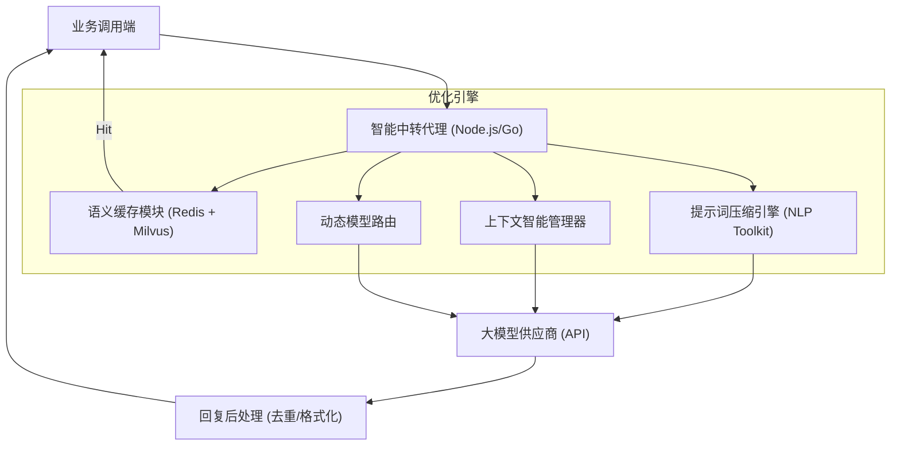

# 大模型中转与 Token 极致优化服务方案 (LLM Proxy & Token Optimization Solution)

## 1. 概述 (Overview)

在大型语言模型 (LLM) 的企业级应用中，Token 消耗是核心运营成本之一。本方案旨在构建一个高性能、智能化的中转代理服务，通过**语义缓存、提示词压缩、上下文剪枝和多级架构迭代**，在保证回复质量的前提下，实现 Token 消耗的极致优化（预期节省 40% - 70%）。

---

## 2. 核心架构设计 (Core Architecture)

系统采用模块化代理架构，位于业务端与大模型供应商（OpenAI, Claude, DeepSeek 等）之间。

---

## 3. 核心 Token 节省策略 (Token-Saving Strategies)

### 3.1 语义缓存 (Semantic Caching)
**传统缓存**仅支持字符串完全匹配，而**语义缓存**通过向量检索实现近义词命中。
- **原理**：将 User 请求通过轻量级 Embedding 模型向量化，存入向量数据库（如 Milvus 或 Qdrant）。
- **优化点**：如果新请求与历史请求余弦相似度 > 0.95，直接返回缓存结果。
- **效果**：针对重复性问题（如客服场景、公共查询），**节省 100% Token**。

### 3.2 提示词压缩 (Prompt Compression)
利用轻量级模型或启发式算法对 Prompt 进行瘦身。
- **冗余剔除**：自动识别并删除 Prompt 中的语气词、停用词以及不必要的格式填充。
- **信息编码**：将冗长的背景资料通过摘要模型（如 GPT-4o-mini 或 Llama-3-8B）预先提炼成精简的 Key-Value 结构。
- **效果**：长文本处理场景下可节省 **20% - 40% 输入 Token**。

### 3.3 智能上下文管理 (Intelligent Context Pruning)
长对话中，历史记录是 Token 消耗的大头。
- **滑窗+摘要重写**：不再发送完整的对话历史。仅保留最近 3 轮原始对话，更早的历史记录通过后台异步转换成 200 字以内的“记忆摘要”。
- **RAG 按需注入**：历史记忆存入本地向量库，仅在当前请求与历史片段高度相关时，才将该片段注入 Prompt，而非全量输入。
- **效果**：对话次数越多，节省比例越高。

### 3.4 动态模型路由 (Context-Aware Routing)
并非所有问题都需要顶级模型（如 GPT-4o）。
- **意图识别**：代理层预先判断问题难度。简单任务（如翻译、润色、格式转换）自动路由至低成本模型（如 GPT-4o-mini, DeepSeek-V3）。
- **多阶执行**：用低成本模型生成草稿，仅在需要复杂逻辑推理时调用高价模型。
- **效果**：单一成本从 \$10 降至 \$0.5，**成本直降 90%**。

---

## 4. 技术栈推荐 (Technology Stack)

| 模块 | 推荐选型 | 说明 |
| :--- | :--- | :--- |
| **中转网关** | Node.js (NestJS) / Go (Gin) | 高并发、低延迟异步处理 |
| **向量数据库** | Milvus / Qdrant | 用于存储 Embedding 后的语义缓存 |
| **高速缓存** | Redis | 存储频繁命中的元数据与结果 |
| **Embedding 模型** | text-embedding-3-small | 极低成本的向量化方案 |
| **监控统计** | Prometheus + Grafana | 实时监控各环节 Token 节省比例与响应耗时 |

---

## 5. 极致优化工作流 (Workflow)

1. **接收请求**：代理拦截业务端 API 请求。
2. **命中检测**：在语义缓存中检索。若命中，$0 Token 消耗立即返回。
3. **上下文裁切**：若未命中，根据智能策略剪枝 Context。
4. **意图路由**：判断请求复杂度，选择最优模型。
5. **Prompt 压缩**：对发送给 LLM 的最终 Payload 进行冗余压缩。
6. **异步入库**：将 LLM 返回的结果异步存入语义缓存，供下次使用。

---

## 6. 预期效益 (Expected Benefits)

- **成本降低**：综合 Token 支出预计下降 **50% 以上**。
- **性能提升**：缓存命中场景下的延迟从 2-10 秒降至 **100 毫秒**以内。
- **可观测性**：提供清晰的 Token 用量账单与优化报表。

---

> [!TIP]
> **落地建议**：建议第一步先上线“语义缓存”模块，这是见效最快且对业务无感的优化手段。后续再逐步迭代“上下文摘要”与“模型路由”策略。
